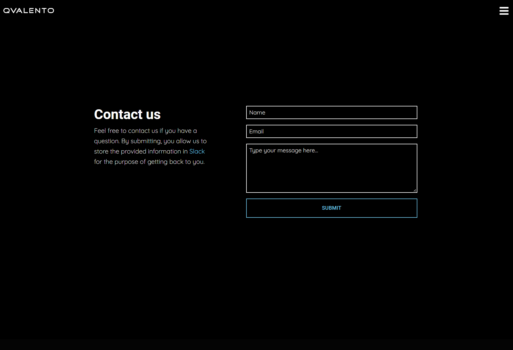
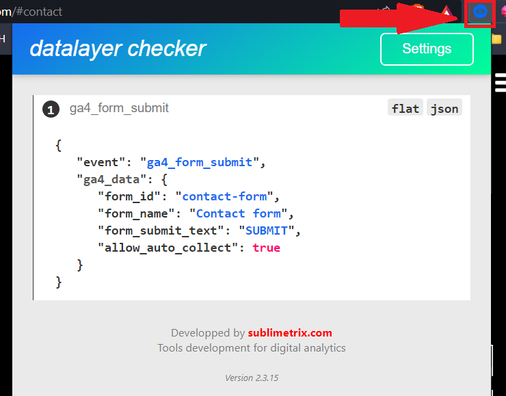

# form_submit

## Description
This event should trigger when a user submits a valid form on the website.


## Example of form

Found on https://qvalento.com/#contact

---

## Event Parameters
The event parameters should be included in the data layer (as seen at the bottom). The following JSON explains what each parameter should contain.
```
{
    params: [
        {
            name: "event_name",
            description: "The name of the event used in GA4",
            type: "string",
            accepted_values: ["ga4_form_submit"],
            example: "ga4_form_submit"
        },
        {
            name: "form_id",
            description: "The id used in the HTML code for the form.",
            type: "string",
            example: "contact-form"
        },
        {
            name: "form_name",
            description: "A descriptive name of the form.",
            type: "string",
            example: "Contact form"
        },
        {
            name: "form_submit_text",
            description: "The text of the submit button.",
            type: "string",
            example: "SUBMIT"
        },
        {
            name: "allow_auto_collect",
            description: "Allows forwarding of the event in GTM to prevent using multiple tags.",
            type: bool,
            example: true
        }
    ]
}
```

---

## Data layer example
Notice that all parameters except for 'event_name' should be put in an object called 'ga4_data', which should always be emptied before pushing new data into it. 
```
// {{e}} represents a dynamic value, where e is an example value
window.dataLayer = window.dataLayer || [];
window.dataLayer.push({ ga4_data: null });
window.dataLayer.push({
    event: "ga4_form_submit",
    ga4_data: {
        form_id: "contact-form",
        form_name: "Contact form",
        form_submit_text: "SUBMIT",
        allow_auto_collect: true
    }
});
```

---

## Validate implementation
The easiest way to validate the data layer is to install the extension "Datalayer Checker" in Chrome. 

Link: https://chrome.google.com/webstore/detail/datalayer-checker/ffljdddodmkedhkcjhpmdajhjdbkogke?hl=en

Then simply click on the icon when testing the event. If it works, the same JSON as the one above should be inserted in the list of the pop up (see image below).

