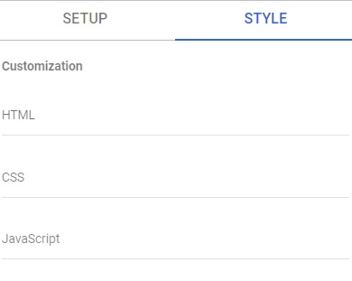
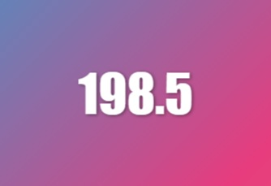

# Qvalento Super Charts
This community visual will allow you to create a chart that looks and behaves exactly however you want to. What the visual provides are mainly three things:
- Custom HTML
- Custom CSS
- Custom JavaScript

You will find these sections in the chart Style tab.


## How it works
When you add data to the chart, it will automatically run a loop for each row created by the combination of added data. In each loop, the provided HTML will be rendered. When the loop is finished, the CSS and JAvaScript will be added to the chart DOM. 

The HTML you add will be placed like this:
```
<div id="qvalento-super-chart">
  <style>
    <!-- Your CSS goes here -->
  </style>
  <div class="container">
    <!-- Your HTML goes here -->
  </div>
</div>
```

JavaScript is executed within the Looker Studio chart inside an eval().

## Add data to the chart
Just like any other chart in Looker Studio, you can simply drag and drop the dimensions and/or metrics you want to use. Once you've dragged at least one field to the data tab, you will se the chart automatically updating. This happens even if you haven't added any HTML yet. It will default to a simple card view.

## How to get the data into the markup
This is super easy. You simply just put the fieln name, just as it's called in the data tab, inside double curly braces: {{field_name}}

## Write your own simple chart
Think of the chart as any web page. Add the HTML, CSS and JavaScript just as you would do when you're creating a web page. Below, you will see an example of a very simple KPI chart, with a useless piece of JavaScript code, but it's only for you to see how you can use it. 

### HTML
```
<span class="kpi">{{hours}}</span>
```

### CSS
```
#qvalento-super-chart {
  display: flex;
  justify-content: center;
  align-items: center;
  height: 100vh;
  background: linear-gradient(-45deg, #ee7752, #e73c7e, #23a6d5, #23d5ab);
  background-size: 400% 400%;
  animation: gradient 15s ease infinite;
}

#qvalento-super-chart.colorswitch {
  background: linear-gradient(-45deg, #5f4b8b, #ec9688, #c5ae91, #b58b28);
  background-size: 400% 400%;
  animation: gradient 15s ease infinite;
}

.kpi {
  font-size: 42px;
  color: #fff;
  font-weight: 400;
  font-family: "Impact";
  text-shadow: 1px 1px 3px rgba(0, 0, 0, 0.5);
}

.kpi:hover {
  cursor: pointer;
}

@keyframes gradient {
  0% {
    background-position: 0% 50%;
  }
  50% {
    background-position: 100% 50%;
  }
  100% {
    background-position: 0% 50%;
  }
}
```

### JavaScript
```
document.querySelectorAll(".kpi").forEach((kpi) => {
  kpi.addEventListener("click", () => {
    kpi.closest("#qvalento-super-chart").classList.toggle("colorswitch");
  });
});
```

The results should look like this, but with a "living" background that changes color when you click on the chart. 



## Filter data by click
If you want to filter report data you can do that by adding "[[filter_attrs]]" in an HTML tag. This will render data attributes that can be listened for with JavaScript. If added, they will also be checked when the report is filtered to add a class to the filtered data called "filter-include". All other data will receive the class name "filter-exclude".
```
<div class="row" [[filter_attrs]]></div>

<div class="row" filter-dimids="qt_zs1va65x2c,qt_90aq555x2c" filter-dim0value="Dummy" filter-dim1value="Something">
```

you can then use that information inside your own JavaScript to decide when to update a report filter. The following script is not based on the example above. 
```
document.addEventListener("click", (e) => {
  let row = e.target.closest("#qvalento-super-chart .row[hours]");
  if (row) {
    const FILTER = dscc.InteractionType.FILTER;
    const actionId = "qvalentofilter";

    if (row.classList.contains("filter-include")) {
      dscc.clearInteraction(actionId, FILTER);
    } else {
      const concepts = row.getAttribute("filter-dimids").split(",");
      let values = [];
      for (let i = 0; i < concepts.length; i++) {
        values.push(row.getAttribute(`filter-dim${i}Value`));
      }

      dscc.sendInteraction(actionId, FILTER, {
        concepts: concepts,
        values: [values],
      });
    }
  }
});  
```